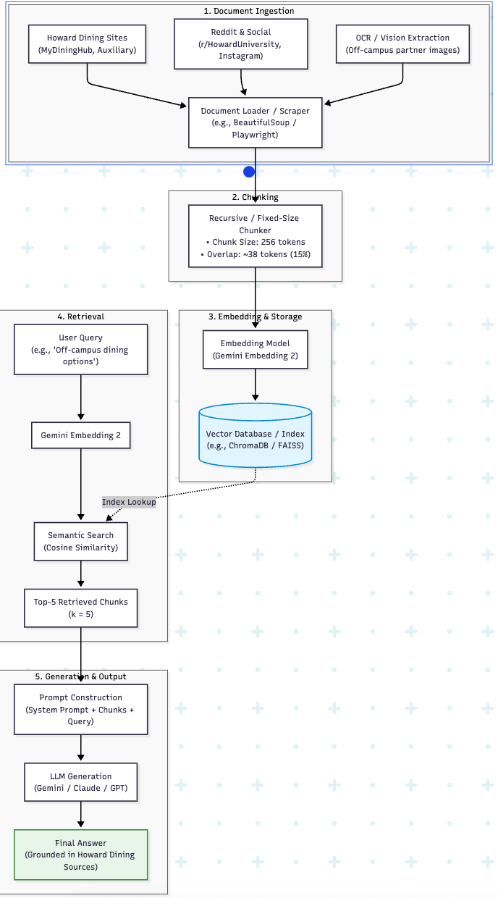

# Project 1 Planning: The Unofficial Guide

> Write this document before you write any pipeline code.
> Your spec and architecture diagram are what you'll use to direct AI tools (Claude, Copilot, etc.) to generate your implementation — the more specific they are, the more useful the generated code will be.
> Update the Retrieval Approach and Chunking Strategy sections if you change your approach during implementation.
> Update this file before starting any stretch features.

---

## Domain

<!-- What domain did you choose? Why is this knowledge valuable and hard to find through official channels? -->

--- I chose Howard's dining services, including information on the Bison One Card. This knowledge is valuable because many students may still be unclear about where they can get food, especially since Howard likes to change things up seemingly yearly.

## Documents

<!-- List your specific sources: URLs, subreddit names, forum threads, or file descriptions.
     Aim for at least 10 sources that together cover different subtopics or perspectives within your domain. -->

| # | Source | Description | URL or location |
|---|--------|-------------|-----------------|
| 1 | | | | https://howard.mydininghub.com/en/locations
| 2 | | | | https://howard.mydininghub.com/en/meal-plan/DiningDollars-667627
| 3 | | | | https://howard.mydininghub.com/en/meal-plans
| 4 | | | | https://auxiliary.howard.edu/services/bison-one-card/where-use-your-card
| 5 | | | | https://studentaffairs.howard.edu/housing/move-in/bison-one-card-meal-plans
| 6 | | | | https://www.instagram.com/bison_hospitality/
| 7 | | | | https://auxiliary.howard.edu/services/bison-one-card/mobile-apps
| 8 | | | | https://auxiliary.howard.edu/services/bison-one-card/summer-programs-and-summer-stay-guests
| 9 | | | | https://auxiliary.howard.edu/services/bison-one-card/terms-conditions
| 10 | | | | https://auxiliary.howard.edu/services/bison-one-card/laundry
| 11 | | | | https://www.reddit.com/r/HowardUniversity/
---

## Chunking Strategy

<!-- How will you split documents into chunks?
     State your chunk size (in tokens or characters), overlap size, and explain why those
     numbers fit the structure of your documents.
     A review-heavy corpus warrants different chunking than a long FAQ. -->

**Chunk size:**

**Overlap:**

**Reasoning:**

--- 256 chunk size, 15% overlap, Most documents consisted of shorter paragraphs or even single sentences

## Retrieval Approach

<!-- Which embedding model are you using (e.g., all-MiniLM-L6-v2 via sentence-transformers)?
     How many chunks will you retrieve per query (top-k)?
     If you were deploying this for real users and cost wasn't a constraint, what tradeoffs
     would you weigh in choosing a different embedding model — context length, multilingual
     support, accuracy on domain-specific text, latency? -->

**Embedding model:** 

**Top-k:**

**Production tradeoff reflection:**

--- Switched from the originally planned Gemini Embedding 2 to all-MiniLM-L6-v2 via sentence-transformers, run locally rather than as a hosted API — 5 chunks per query. Accuracy and latency would be the top two things I would refine for production, trading off things like multilingual support to be as fast and accurate as possible.

## Evaluation Plan

<!-- List your 5 test questions with their expected correct answers.
     Questions should be specific enough that you can judge whether the system's response
     is right or wrong. "What are good dining halls?" is too vague.
     "What do students say about wait times at [dining hall name] during lunch?" is testable. -->

| # | Question | Expected answer |
|---|----------|-----------------|
| 1 | | | What meal plans are available to me as a Junior?
| 2 | | | What dining options are open right now?
| 3 | | | What do people say about food at BlackBurn?
| 4 | | | What resturants that are off campus can I use my MP bucks at?
| 5 | | | Can I only use my Bison One Card for food?

---

## Anticipated Challenges

<!-- What could go wrong? Name at least two specific risks with reasoning.
     Consider: noisy or inconsistent documents, missing source attribution, off-topic
     retrieval, chunks that split key information across boundaries. -->

1.Some of the pages have tabs and retreiving data from them might be difficult.

2.Pictures might also be a problem for getting chunk information. The off campus partners are in an image on one of the urls.

---

## Architecture

<!-- Draw a diagram of your pipeline showing the five stages:
     Document Ingestion → Chunking → Embedding + Vector Store → Retrieval → Generation
     Label each stage with the tool or library you're using.
     You can use ASCII art, a Mermaid diagram, or embed a sketch as an image.
     You'll use this diagram as context when prompting AI tools to implement each stage. -->

--- 

## AI Tool Plan

<!-- For each part of the pipeline below, describe:
     - Which AI tool you plan to use (Claude, Copilot, ChatGPT, etc.)
     - What you'll give it as input (which sections of this planning.md, which requirements)
     - What you expect it to produce
     - How you'll verify the output matches your spec

     "I'll use AI to help me code" is not a plan.
     "I'll give Claude my Chunking Strategy section and ask it to implement chunk_text()
     with my specified chunk size and overlap" is a plan. -->

**Milestone 3 — Ingestion and chunking:** 
AI Tool: Claude 3.5 Sonnet

Input Given: The Documents, Chunking Strategy, and Anticipated Challenges sections from planning.md, along with the Stage 1 & 2 blocks from the architecture diagram. 

Expected Output: Python scripts/functions (scrape_sources(), extract_image_text(), and chunk_text()) that pull raw text from the URLs, parse image text, clean boilerplates, and split the corpus into recursive chunks of 256 tokens with a 38-token (15%) sliding overlap while attaching source metadata to each chunk.

Verification Method: Inspect chunk lengths using tiktoken to confirm that token counts do not exceed 256, verify that adjacent chunks share exactly ~38 overlapping tokens, and test scraping against dynamic/tabbed pages to verify that no core dining hall text or image data is omitted or corrupted.

**Milestone 4 — Embedding and retrieval:**
AI Tool: Claude 3.5 Sonnet

Input Given: The Retrieval Approach section and Stages 3 & 4 from the architecture diagram, using the embedding model Gemini Embedding 2 and vector database target ChromaDB.

Expected Output: A pipeline script that takes the chunked documents, generates embeddings using the Gemini Embedding API, indexes them into the vector store with cosine similarity metrics, and implements a retrieval function retrieve_context(query, k=5) that returns the top-5 most relevant chunks.

Verification Method: Run a few manual query embeddings and verify via unit tests that retrieve_context(query, k=5) returns exactly 5 documents formatted with similarity scores and metadata.

**Milestone 5 — Generation and interface:**
AI Tool: Claude 3.5 Sonnet

Input Given: The Evaluation Plan, Stage 5 from the architecture diagram, and instructions for building a simple CLI or Streamlit interface.

Expected Output: A generation module that builds a grounded prompt (System Prompt + Top-5 Chunks + User Query) preventing hallucination, sends it to the generation model Claude, displays the cited answer in the user interface (Streamlit / CLI), and a test runner script.

Verification Method: Execute the 5 evaluation questions from the plan against the running interface; compare generated answers directly against the expected outputs, ensuring the LLM cites retrieved chunks and refuses to answer off-domain queries without source context.